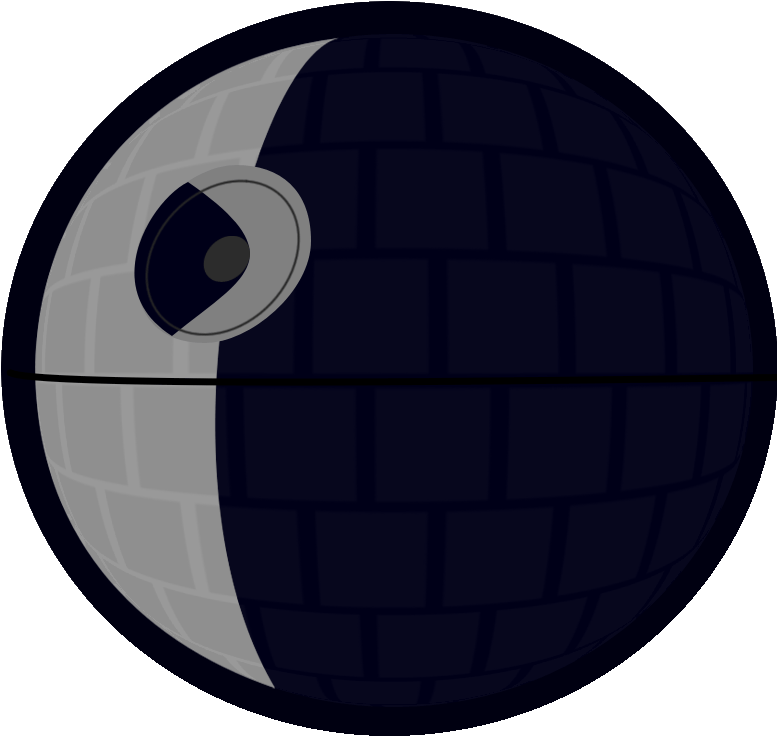

<p align="center"></p>
<h1 align="center">Aurebesh</h1>

<div>
    <hr/>
</div>

## Premise :rocket:

Aurebesh is a modern, user-friendly command line shell for Linux systems, inspired by Unix-like shells and drawing some inspiration from the [F# programming language](https://fsharp.org/). Like its namesake—**the written script used in a galaxy far, far away**—Aurebesh offers seamless, intuitive functionality to enhance your command line experience. It brings features like **command history**, **piping** (forward and backward), **Git integration** into the prompt, fast **cd** command (similar to [zoxide](https://github.com/ajeetdsouza/zoxide)), and more.

<p align="center"></p>


## Features Overview

Aurebesh is packed with features to enhance your command-line experience, including:

- **Command History**: Navigate through your command history using the Up/Down arrow keys to easily rerun or modify previous commands.

- **Piping Support**: Supports both forward and backward piping, allowing for seamless data flow between commands.

- **System Command Highlighting**: Highlights system commands for improved visibility.

- **Git Status Integration**: The prompt displays the current Git repository status, making it easy to stay informed about your version control at a glance.

- **Fast Directory Navigation**: Features smart directory-switching akin to the zoxide tool for quick access to frequently visited directories.

- **Alias and Variable Support**: Create shortcuts for frequently used commands and manage environment variables effortlessly.

- **Tab Completion**: Autocomplete commands and file paths, enhancing navigation and efficiency for commands like cd.

- **Advanced Command Execution**: Execute commands using operators like &, &&, and redirect output to files using > and >>.

### Example Commands
- **pipe**: `ls |> grep .txt`
> [!NOTE]
> The pipe operator is `|>` and not `|` as in other Unix-like shells.

- **backward pipe**: `grep .txt <| ls`

- **write into file**: `write "Hello, Aurebesh!" > hello.txt`

## Dependencies

Running Aurebesh requires:
- Basic POSIX utilities such as cat, cut, ls, rm, and mkdir.
- **Ncurses**: Provides terminal handling functionalities (usually pre-installed on most Linux distributions).
- **Git**: Required for Git integration in the prompt.

## Building Aurebesh :hammer_and_wrench:
The project is structured as a CMake project. To build Aurebesh, follow these steps:

1. Clone the repository:
```bash
git clone
```

2. Navigate to the project directory:
```bash
cd aurebesh
```

3. Build the project:
```bash
make
```

4. Run the Aurebesh shell:
```bash
./aurebesh
```

## License :book:
This project is licensed under the GPL-3.0 License - see the [LICENSE](LICENSE) file for details.

## Final Note:

With Aurebesh, you’re not just entering commands—you’re communicating in the universal language of the terminal, crafted with elegance and speed. Whether navigating through directories or interacting with Git, may the commands be with you.


